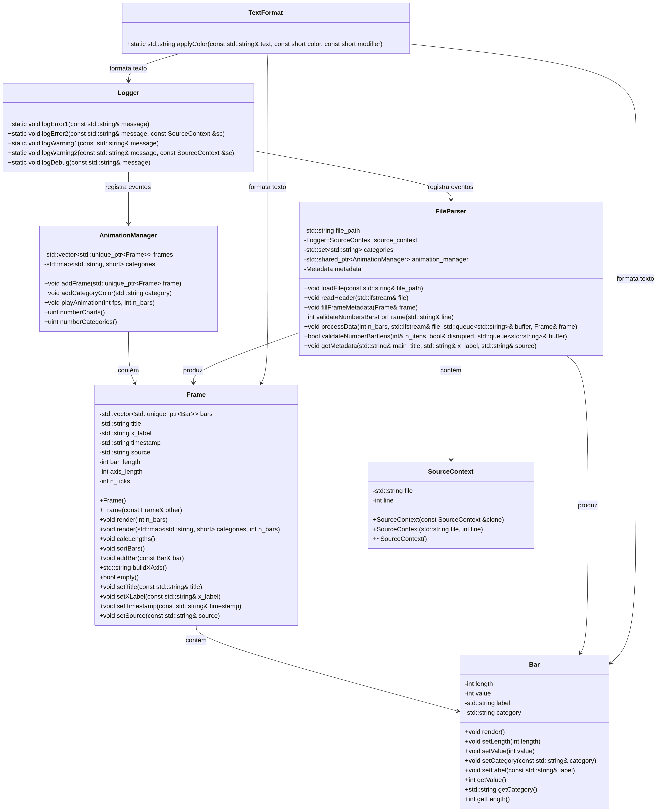

# Bar Chart Race (bcr)

Authors: Lucas Apolonio de Amorim, Moisés Ferreira de Lima

## Table of Contents
1. [Introduction](#introduction)
2. [Input](#input)
3. [Interface](#interface)
4. [Execution](#execution)
5. [System Modelling](#system-modelling)
6. [Output](#output)
7. [About Refactoring](#about-refactoring)

## Introduction

The **bcr** (**b**ar **c**hart **r**ace) program is a terminal-based application designed to visualize the evolution of categorical data over time using animated bar charts. Each bar chart consists of up to 15 horizontal bars, where the length of each bar corresponds to the value of the data it represents. The bars are colored according to their category, providing an intuitive way to track changes in data trends.

The program reads data from a CSV file, processes it, and displays a sequence of bar charts in the terminal, creating an animation effect. This animation helps users observe how data values change over time, with bars "racing" to the top as their values increase or decrease.

## Input

The program reads data from a CSV file with the following structure:

1. **Header**: The first three lines of the file contain metadata:
   - **Title**: The title of the chart.
   - **Label**: The label associated with the values in the chart.
   - **Source**: The source of the data.

2. **Data**: After the header, the file contains:
   - A single integer `n_bars`, indicating the number of bars in the current bar chart.
   - `n_bars` lines of data, each in the format:
     ```
     time_stamp, label, other_related_info, value, category
     ```
     - **time_stamp**: The timestamp for the data (e.g., year).
     - **label**: The name or identifier of the data item.
     - **other_related_info**: Additional information (not used in visualization).
     - **value**: The numerical value represented by the bar.
     - **category**: The category of the data item, used for color mapping.

Example datasets, such as `countries.txt`, are available for download [here](https://github.com/lucasaamorim/barchart_datasets).

## Interface

The program is executed via the command line with the following syntax:
```
./bcr [<options>] <input_data_file>
```
### Options:
- **-b <num>**: Specifies the maximum number of bars to display in a single chart. The valid range is [1, 15], with a default value of 5.
- **-f <num>**: Sets the animation speed in frames per second (fps). The valid range is [1, 24], with a default value of 24.

If the dataset contains fewer bars than requested, the program will display only the available bars. If the dataset contains more bars than requested, the program will display the specified number of bars.

## Execution

The program follows these steps to process and display the data:

1. **Read the Header**: Extract the title, label, and source information from the first three lines of the input file.
2. **Read Data**:
   - Read the number of bars (`n_bars`) for the current bar chart.
   - Create a `Frame` object to store the bars.
   - For each bar, read the data line, create a `Bar` object, and add it to the `Frame`.
   - Store the timestamp for the bar chart.
   - Sort the bars in descending order based on their values.
   - Add the sorted `Frame` to the `AnimationManager`.
3. **Display Summary**: After reading all data, the program displays a summary of the input file (title, source, number of bars) and prompts the user to start the animation.
4. **Animate**: The program displays the bar charts in sequence, pausing between frames according to the specified fps value. The pause duration is calculated as `1000ms / fps`.

## System Modelling

The System has its classes organized the following way:



The diagram was created using [mermaid.js](http://mermaid.js.org/) and can also be viewed [here](https://mermaid.live/edit#pako:eNqtV-9q4zgQfxXhD8Hl3JKmTZr4w8Fud5c7aI-DXe6WIxAUW3bEypJPkkuzpXmfe457sRvZcirbclqODZTKmv8zv5mxn4JEpCSIg4RhpT5QnEtcrDmCX32D3nFaYE0Fv8cc50Sip4ZqfudKp3H8QBIt5KE-V5z-XZFNqeXhEygihwPKzH_VFypw2UgoLSnPI6R2QuoDSrAmuZDUlfjpQdAU4TStVYZ-Q42dM4_UbaNyfyuYkKFjtDW2H0iVDO-PgYeUa5SVKkLmwDdbLJUrUdXXVbEl8naHpVbhGPUYW8vxvOZurutI3pzg91hCeo03fQEbnqaakRHa44bhLWGjklAyjYtyhK5EJRNXtQkSPNkwwnO96xHwI1V-Ct9omnxzS92U-GxwkwiudJOgCRJ6R-SgaJLwlMjQXySX440AHKt3rSrBLLmrQ-qWuyYq0ATV8VAAjkCw0cBpYrLmcrlZ3laUpV_fQfY6irZCMESKUu89lon-YqpuLTjaJg0cfBJf7wwUfCIWJX4zFiJ-U5bok_xcg8cn1sDK3xuQrE5nmNp4MfWAWTWG-lOYb4fBCGh8kTQACF9c8TH9YfwJj575WNoJ5cvJ6Iwy9sfqNqiaMZ-3vozhLXc88QjbaEdGF2Xkd4C8b0FY9RmwbErcKdidyGGnxHGDiVvBNXnUFgebpHkcqCPa7Vz_zrCsMI9JWk_L_h47INzebIrmypG-JxqnWGNU2EM_-0zg1MTsy_4xUM8Awukv8NcOIZqBDMFFIzNgh0tWj7zWndAOwMGus_CiwER-q5eNMgPok5DOzjyig_KhrVKKhMAbgLHyMvci5PHTXsIeqkinEjDNqiwjMkJjftazq-so-PmrJlwZqxMwS81DhAznBKVUyarUJH3V5iAgQOwxbZ3wC0zN3tHHQHrTLnr7UPoC8IQcA4xc1ENTAa4SVw3CZcnsG4hvXoKeCFmC2UNwBtbuVSFSmtFjpD1Xmk7yuWHxmn-UUshLn3kY1goa4OwV2dkJ2dbVbiNPVHJC6Z9YctDxP12y0j_aqQ9kW-Wve9TLftfCqQnYX2HQi44zHT2h1_uEiW77dmX69pq3mH7LH7pC_aAGL_3n5z_bt9PY5FT_-4_9SGguDdks6D7xZSm4CmDUpNV3L0uj5ARDNxk9e047Gl7bEjHK6jtct5nwsrauvc7ZeOjhs9YMzyB9MUz-nEJVMCIPhGuhBjJOnD7uIAoKAjZpCt9qNb7WAbwFF2QdxHBMSYYrptfBmj8DK660-LznSRBrWZEokKLKd0GcYabgqSrN9LXfesfbEvO_hChaEXgM4qfgMYgXy_nFajm9uZwtV9PFbB4F-yC-ml9MV6vFYjFfza_ny9Xy-jkKvtfy04vl8vpmfrW6ms4uZzdXlzdRQFIKnzD39lPT_Hv-D5M7tZs).


## Output

The program outputs a series of bar charts in the terminal, with the following components:

1. **Main Title**: The title of the chart, extracted from the input file header.
2. **Bar Chart Title**: The timestamp for the current bar chart.
3. **Bars**: A sequence of colored bars, sorted in descending order of value. Each bar is colored according to its category. If there are more than 15 categories, all bars are displayed in a single color.
4. **X-Axis**: A horizontal axis below the bars, with reference marks and numerical values. The axis includes 10 equally spaced marks between the minimum and maximum values in the current bar chart.
5. **Source**: A line indicating the source of the data, extracted from the input file header.
6. **Color Legend**: A legend showing the association between colors and categories (if there are 15 or fewer categories).

The animation is achieved by sequentially displaying bar charts in the terminal, with pauses between frames to create the illusion of movement.

## About Refactoring
The video on the refactoring of the old project can be viewed on [Loom](https://www.loom.com/share/fa364010171d4ef9b4d10dfb512798c1)

---

&copy; DIMAp/UFRN
